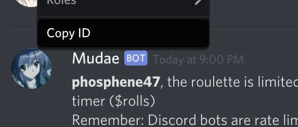

# MudaeFarm

**WARNING**: selfbots are officially banned. It is considered an API abuse and is [no longer tolerated](https://support.discordapp.com/hc/en-us/articles/115002192352-Automated-user-accounts-self-bots-).

This is a simple bot that automatically rolls and claims Mudae waifus/husbandoes.

## Setup

1. Install [.NET Core SDK](https://dotnet.microsoft.com/download).

2. Download this repository [as a zip](https://github.com/chiyadev/MudaeFarm/archive/master.zip).

3. Once the file is downloaded, unzip it. Move into the folder named `MudaeFarm` and create a file called `config.json` with the following contents:

```json
{
  "AuthToken": "INSERT YOUR TOKEN HERE"
}
```

How to find your user token:

Press `Ctrl+Shift+I` or `Command+Option+I` on Discord which opens Chrome inspector then click on the tab named `Network`. Click on `XHR`.


Open any channel or type something on Discord, which should create an entry named `science`.


Under `Request Headers` find your authorization token.


DO NOT EVER SHARE THIS TOKEN WITH ANYONE. TREAT THIS TOKEN LIKE YOU TREAT YOUR PASSWORD.

4. Open terminal or CMD in the folder and run these commands: `dotnet build`, `dotnet run`

### Note

This bot does not automatically know which Mudae maid you are using. You may need to copy the ID of the Mudae maid and add it to `MudaeFarm/Program.cs` before running the bot.

```csharp
public static ulong[] MudaeIds = new ulong[]
{
    PASTE_MUDAE_MAID_ID_HERE
};
```



## Commands

Autorolling:

- `/rollinterval {minutes}` — Sets the autoroll interval in minutes. Setting this to `-1` disables autorolling.
- `/setchannel` — Sets the channel where you send this command as a bot channel. You can do this in however many channels as you like.
- `/unsetchannel` — Stops autorolling in the channel where you send this command.
- `/marry waifu` — Sets the marry command to waifus (`$w`). This is the default.
- `/marry husbando` — Sets the marry command to husbandoes (`$h`).

Autoclaiming:

- `/wish {character}` — Adds a character to your wishlist.
- `/unwish {character}` — Removes a character from your wishlist.
- `/wishani {anime}` — Adds an anime to your wishlist. This is akin to wishing every character from that anime.
- `/unwishani {anime}` — Removes an anime from your wishlist.
- `/wishlist` — Shows the list of your wished characters.
- `/wishlistani` — Shows the list of your wished anime.
